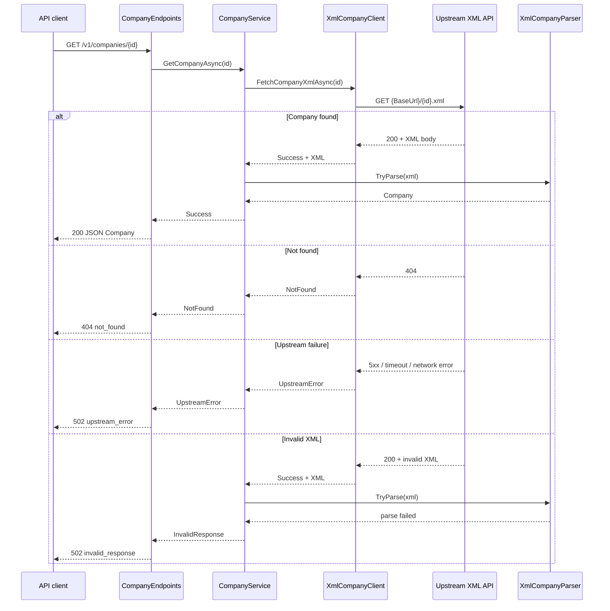

# MWNZ Companies API

A small ASP.NET Core API that proxies the [MWNZ evaluation XML service](https://github.com/MiddlewareNewZealand/evaluation-instructions), transforms company data to JSON, and exposes it according to [openapi-companies.yaml](./openapi-companies.yaml).

## Repository structure

```
├── .github/workflows/        # GitHub Actions (audit, Docker build, tests)
├── Mwnz.slnx                 # Solution file
├── docker-compose.yml        # Runs the mwnz-api container
├── openapi-companies.yaml    # Target API contract (from evaluation repo)
├── Mwnz.Api/                 # ASP.NET Core Web API (Docker container: mwnz-api)
│   ├── Integrations/XmlCompany/   # Integration with the upstream XML API
│   │   ├── Models/           # XmlCompany — external service XML shape
│   │   ├── XmlCompanyClient.cs
│   │   ├── XmlCompanyParser.cs
│   │   └── …                 # IXmlCompanyClient, IXmlCompanyParser, XmlFetchResult
│   ├── Configuration/        # XmlApiOptions (upstream URL, timeout)
│   ├── Endpoints/            # Minimal API routes (companies, OpenAPI spec)
│   ├── Models/               # API domain models (Company, ApiError)
│   ├── Services/             # CompanyService — orchestration and error mapping
│   ├── Dockerfile
│   └── Program.cs
└── Mwnz.Api.Test/            # xUnit + Moq
    ├── Unit/                 # XmlCompanyClient, XmlCompanyParser, CompanyService
    ├── Integration/          # HTTP endpoints via WebApplicationFactory
    └── TestCategories.cs     # Category names for filtered test runs
```

### How it works

1. `GET /v1/companies/{id}` hits **Endpoints** → **CompanyService**.
2. **XmlCompanyClient** (`Integrations/XmlCompany`) fetches `{XmlApi:BaseUrl}/{id}.xml` from GitHub (configurable).
3. **XmlCompanyParser** deserializes the upstream `<Data>` document into `Integrations.XmlCompany.Models.XmlCompany`, then maps to the API `Company` model.
4. JSON is returned matching the OpenAPI `Company` schema, or an `Error` body on failure.



Uncaught exceptions are logged by **GlobalExceptionHandler** and returned as **500** `internal_error`.

The evaluation OpenAPI document is embedded in the API assembly and served at `GET /openapi/v1.yaml` (`application/yaml`).

| Condition | HTTP status | `error` code |
|-----------|-------------|--------------|
| Company not found (upstream **404**) | **404** | `not_found` |
| Network / upstream HTTP failure | **502** | `upstream_error` |
| Upstream OK but XML invalid | **502** | `invalid_response` |

## Prerequisites

| Tool | Version |
|------|---------|
| [.NET SDK](https://dotnet.microsoft.com/download) | 10.0+ |
| [Docker Desktop](https://www.docker.com/products/docker-desktop/) (optional, for container runs) | Recent |

## Run locally (without Docker)

```bash
dotnet restore
dotnet run --project Mwnz.Api
```

The API listens on the URLs shown in the console (typically `http://localhost:5229` in Development).

Example requests:

```bash
curl http://localhost:5229/v1/companies/1
curl http://localhost:5229/v1/companies/2
curl http://localhost:5229/health
curl http://localhost:5229/openapi/v1.yaml
```

## Run with Docker

From the repository root:

```bash
docker compose up --build
```

`docker-compose.yml` tags the service as `carlpetermeyer/mwnz-api:latest` (same image name CI builds and publishes).

The API is available at **http://localhost:8080**.

```bash
curl http://localhost:8080/v1/companies/1
curl http://localhost:8080/v1/companies/2
curl http://localhost:8080/health
curl http://localhost:8080/openapi/v1.yaml
```

To stop:

```bash
docker compose down
```

### Build the image only

```bash
docker build -f Mwnz.Api/Dockerfile -t mwnz-api .
docker run --rm -p 8080:8080 mwnz-api
```

The Docker build expects `openapi-companies.yaml` at the repository root (see `Mwnz.Api/Dockerfile`).

## Configuration

Settings in `Mwnz.Api/appsettings.json`:

| Key | Description | Default |
|-----|-------------|---------|
| `XmlApi:BaseUrl` | Base URL for upstream XML files | GitHub `evaluation-instructions` `xml-api` path |
| `XmlApi:TimeoutSeconds` | HTTP timeout for upstream calls | `30` |

Override via environment variables (Docker example):

```bash
XmlApi__BaseUrl=https://example.com/xml-api
XmlApi__TimeoutSeconds=15
```

## Tests

All tests live in **Mwnz.Api.Test**. Each test class is tagged with a **Category** trait. Upstream HTTP is mocked with [Moq](https://github.com/devlooped/moq) in unit and integration tests.

| Category | What it covers |
|----------|----------------|
| `Unit` | `XmlCompanyClient` (HTTP handler stubs), `XmlCompanyParser`, `CompanyService` |
| `Integration` | Full HTTP pipeline via `WebApplicationFactory` (company routes, health, OpenAPI spec) |

### Run all tests

```bash
dotnet test
```

### Run unit tests only

```bash
dotnet test --filter "Category=Unit"
```

### Run integration tests only

```bash
dotnet test --filter "Category=Integration"
```

## Continuous integration

The [**Build and Publish**](./.github/workflows/ci.yml) workflow (`.github/workflows/ci.yml`) validates every change to `main` and publishes container images after a successful merge.

### Triggers

| Event | Branch | Docker publish |
|-------|--------|----------------|
| Push | `main` | Yes |
| Pull request | `main` | No (build and test only) |

### Pipeline

The single job `build-and-test` runs on `ubuntu-latest` and performs these steps in order:

1. **Checkout** — clone the repository.
2. **Setup .NET SDK** — install .NET 10.0.x.
3. **.NET audit** — `dotnet restore` and `dotnet list package --vulnerable --include-transitive` to flag vulnerable dependencies.
4. **Build Docker images** — `docker compose build` (image `carlpetermeyer/mwnz-api:latest`, see [docker-compose.yml](./docker-compose.yml)).
5. **Start API container** — `docker compose up -d` on port 8080.
6. **Wait for API** — poll `GET /health` for up to ~60 seconds.
7. **Run .NET tests** — `dotnet test Mwnz.slnx`.
8. **Smoke test containerized API** — HTTP checks against the running container (only if unit/integration tests passed):

   | Check | Expectation |
   |-------|-------------|
   | `GET /health` | Response contains `healthy` |
   | `GET /openapi/v1.yaml` | OpenAPI 3.0.2 document |
   | `GET /v1/companies/1` | Response contains `MWNZ` |
   | `GET /v1/companies/2` | Response contains `Other` |

9. **Stop API container** — `docker compose down` (always runs).
10. **Publish to Docker Hub** (push to `main` only) — log in, tag with the workflow run number, and push both tags:

    - `carlpetermeyer/mwnz-api:latest`
    - `carlpetermeyer/mwnz-api:<run_number>` — monotonic build number from [`github.run_number`](https://docs.github.com/en/actions/learn-github-actions/contexts#github-context)

### Viewing results

- **Summary** (Actions run → *Summary*): smoke-test table; on `main` pushes, a table of published image tags and a link to [Docker Hub](https://hub.docker.com/r/carlpetermeyer/mwnz-api).

### Docker Hub secrets

Publishing requires these [repository secrets](https://docs.github.com/en/actions/security-for-github-actions/security-guides/using-secrets-in-github-actions):

| Secret | Description |
|--------|-------------|
| `DOCKERHUB_USERNAME` | Docker Hub account name |
| `DOCKERHUB_TOKEN` | [Access token](https://docs.docker.com/security/for-developers/access-tokens/) with push permission for `carlpetermeyer/mwnz-api` |

Without these secrets, push steps are skipped and the job can still pass if build and tests succeed.

### Pull a published image

After a successful `main` build:

```bash
docker pull carlpetermeyer/mwnz-api:latest
# or a specific build, e.g. docker pull carlpetermeyer/mwnz-api:42
docker run --rm -p 8080:8080 carlpetermeyer/mwnz-api:latest
```

## API reference

The contract is defined in [openapi-companies.yaml](./openapi-companies.yaml). The running service exposes:

| Method | Path | Description |
|--------|------|-------------|
| GET | `/v1/companies/{id}` | Company JSON (`id`, `name`, `description`) |
| GET | `/openapi/v1.yaml` | OpenAPI 3.0 specification (YAML) |
| GET | `/health` | Liveness check (`{"status":"healthy"}`) |

## Deployment

Published image: `carlpetermeyer/mwnz-api:latest` (or a specific `carlpetermeyer/mwnz-api:<run_number>` from CI). The container listens on **HTTP port 8080** only (`ASPNETCORE_URLS=http://+:8080` in the [Dockerfile](./Mwnz.Api/Dockerfile)).

Suitable hosts include Azure Kubernetes Service (AKS), Azure Container Apps, Azure Container Instances, and Azure Red Hat OpenShift.

### Ports

| Name | Port | Protocol | Notes |
|------|------|----------|--------|
| `http` | **8080** | TCP | **Expose this port** on the container/pod. Map it from a Service, ingress, or load balancer as needed (e.g. 80 → 8080). |

No other ports are required. HTTPS termination is typically handled at the ingress or load balancer.

### Health endpoints

| Probe type | Path | Expected success | Purpose |
|------------|------|------------------|---------|
| **Startup** | `GET /health` | HTTP **200**, body contains `"healthy"` | Allow time for the .NET runtime and Kestrel to start before liveness/readiness failures count. |
| **Liveness** | `GET /health` | HTTP **200** | Restart the instance if the process is hung or no longer serving HTTP. |
| **Readiness** | `GET /health` | HTTP **200** | Remove the instance from load balancing until it can accept traffic. |

`GET /health` returns `{"status":"healthy"}` and does **not** call the upstream XML API. Company routes (`/v1/companies/{id}`) may still return **502** when the upstream service is unavailable; that is an application-level error, not a probe failure.

Optional stricter readiness: use `GET /v1/companies/1` only if you need to verify end-to-end connectivity to the upstream XML host. This adds latency, depends on external network access, and is **not** recommended for liveness or startup probes.

### Suggested probe timings

CI waits up to ~60 seconds for `/health` after container start. Use similar or slightly higher budgets for startup probes.

| Probe | `httpGet.path` | `port` | `initialDelaySeconds` | `periodSeconds` | `timeoutSeconds` | `failureThreshold` | `successThreshold` |
|-------|----------------|--------|------------------------|-----------------|------------------|--------------------|--------------------|
| Startup | `/health` | 8080 | 0 | 5 | 3 | **12** (~60s) | 1 |
| Liveness | `/health` | 8080 | 0 | 10 | 3 | 3 | 1 |
| Readiness | `/health` | 8080 | 0 | 5 | 3 | 3 | 1 |

### Kubernetes example

```yaml
containers:
  - name: mwnz-api
    image: carlpetermeyer/mwnz-api:latest
    ports:
      - name: http
        containerPort: 8080
        protocol: TCP
    env:
      - name: ASPNETCORE_ENVIRONMENT
        value: Production
      # Optional: XmlApi__BaseUrl, XmlApi__TimeoutSeconds (see Configuration)
    startupProbe:
      httpGet:
        path: /health
        port: http
      periodSeconds: 5
      timeoutSeconds: 3
      failureThreshold: 12
    livenessProbe:
      httpGet:
        path: /health
        port: http
      periodSeconds: 10
      timeoutSeconds: 3
      failureThreshold: 3
    readinessProbe:
      httpGet:
        path: /health
        port: http
      periodSeconds: 5
      timeoutSeconds: 3
      failureThreshold: 3
```

Expose the workload with a `Service` targeting port **8080** (`targetPort: http`).

### Azure Container Apps

- **Ingress**: enable HTTP ingress and set the target port to **8080**.
- **Probes**: configure HTTP probes on port **8080**, path `/health`. Map Container Apps probe types to startup, liveness, and readiness using the timings above (Container Apps supports separate startup and liveness HTTP probes).

### Azure Container Instances

- Set **ports** to `8080` (TCP).
- Configure **liveness** and **readiness** HTTP probes (or a single health check) to `http://127.0.0.1:8080/health` with a startup grace period of at least 30–60 seconds for cold start.

### Configuration at deploy time

Override upstream settings with environment variables if needed (see [Configuration](#configuration)):

| Variable | Example |
|----------|---------|
| `XmlApi__BaseUrl` | `https://raw.githubusercontent.com/.../xml-api` |
| `XmlApi__TimeoutSeconds` | `30` |
| `ASPNETCORE_ENVIRONMENT` | `Production` |

Ensure outbound HTTPS access to the configured `XmlApi:BaseUrl` host from the cluster or container environment.

